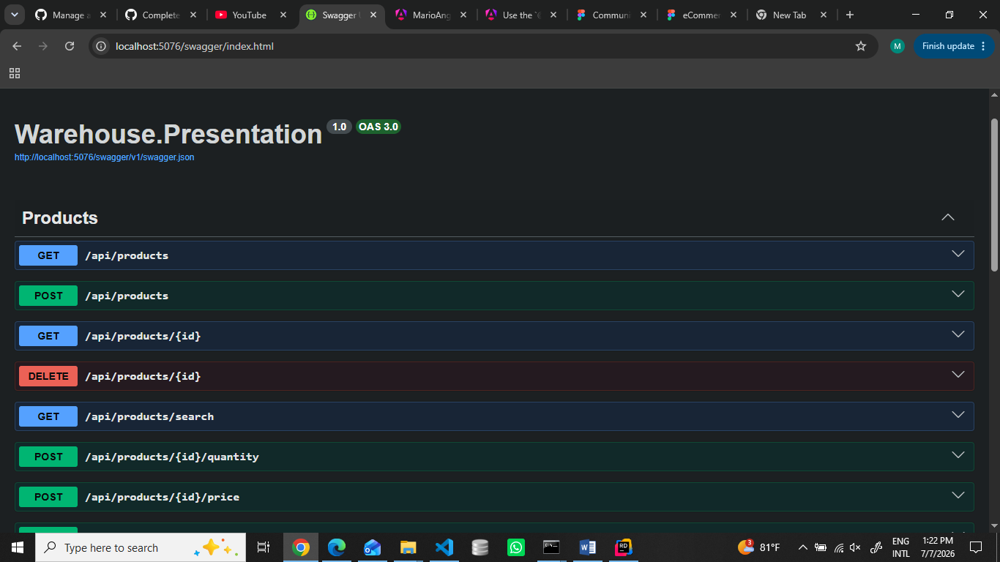
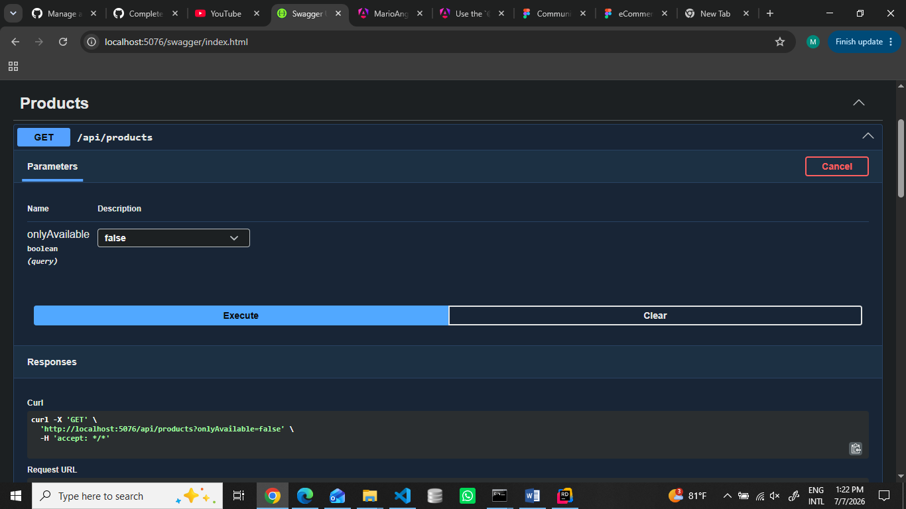
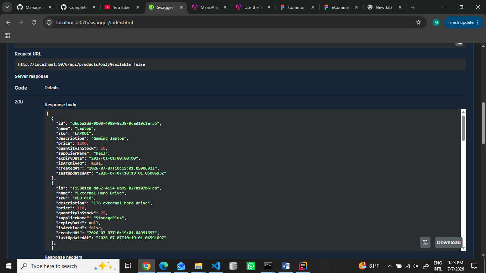
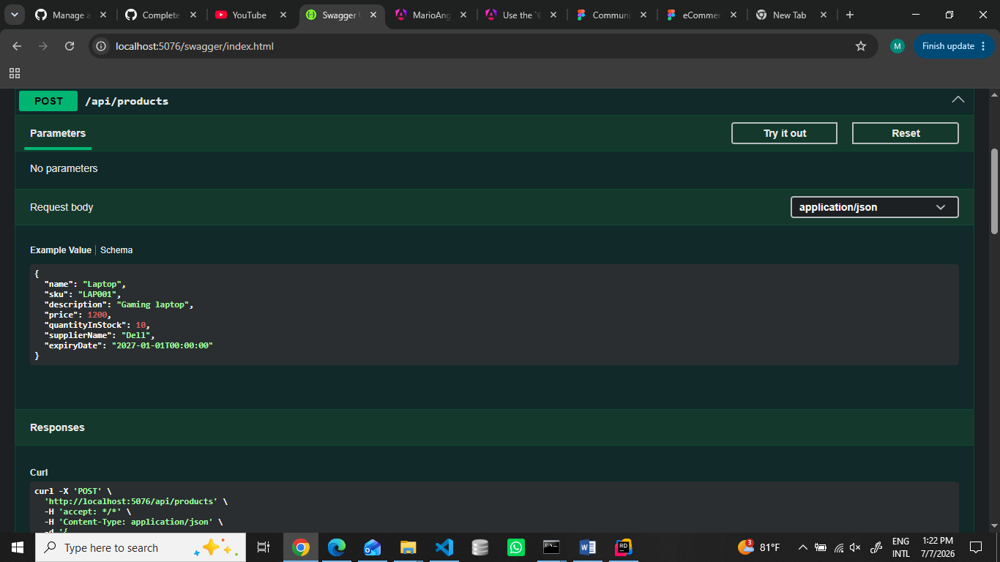
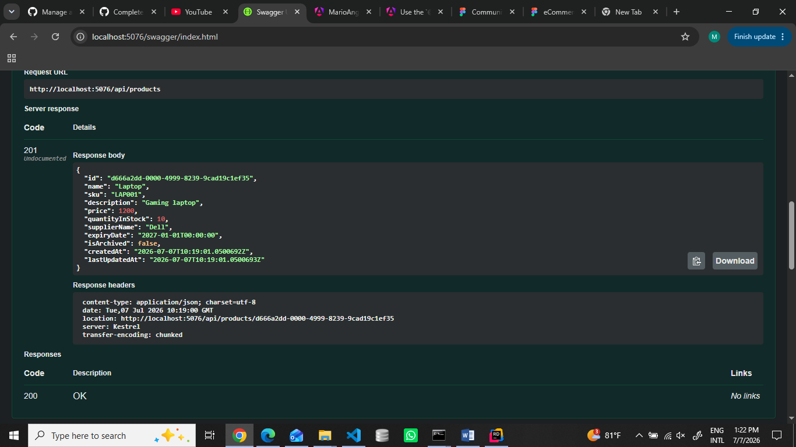

# Warehouse Management API - Session 03 Refactor

## Overview

This session focuses on refactoring the Warehouse Management API using DDD architecture, Repository Pattern, Dependency Injection, and CQRS-style use cases.

The goal was to improve the project structure by separating business logic, application logic, data access, and API responsibilities while keeping the existing API behavior.

---

# Architecture

The project is divided into four layers:

- Warehouse.Domain
- Warehouse.Application
- Warehouse.Infrastructure
- Warehouse.Presentation

---

# Layer Responsibilities

## Warehouse.Domain

Responsible for core business logic.

Contains:

- Entities
- Business rules
- Repository interfaces

Examples:

- Product
- Supplier
- StockMovement
- WarehouseItem
- ProductImage

Business rules:

- Product name is required
- SKU is required
- Price must be greater than zero
- Quantity cannot be negative
- Archived products cannot be updated
- Inactive suppliers cannot be assigned

---

## Warehouse.Application

Responsible for application use cases.

Contains:

- Commands
- Queries
- Handlers

Implemented use cases:

### Product Commands

- CreateProduct
- UpdateProductQuantity
- UpdateProductPrice
- ArchiveProduct
- AssignSupplierToProduct

### Product Queries

- GetProductById
- ListProducts
- SearchProducts

### Supplier Commands

- CreateSupplier
- DeactivateSupplier

### Supplier Queries

- GetSupplierById
- ListSuppliers

MediatR is used to separate requests and handlers.

---

## Warehouse.Infrastructure

Responsible for technical implementation.

Contains:

- Repository implementations
- Data access logic

Repositories:

- ProductRepository
- SupplierRepository

The Application and Domain layers do not know how data is stored.

---

## Warehouse.Presentation

Responsible for HTTP communication.

Contains:

- Controllers
- API endpoints

Controllers only:

- Receive HTTP requests
- Call application use cases
- Return HTTP responses

Business rules and storage access were removed from controllers.

---

# Refactored Endpoints

## Products

| Method | Endpoint |
|---|---|
| GET | `/api/products` |
| GET | `/api/products/{id}` |
| GET | `/api/products/search` |
| POST | `/api/products` |
| POST | `/api/products/{id}/quantity` |
| POST | `/api/products/{id}/price` |
| POST | `/api/products/{id}/image` |
| DELETE | `/api/products/{id}` |
| GET | `/api/products/server-time` |
| POST | `/api/products/{id}/assign-supplier/{supplierId}` |

## Suppliers

| Method | Endpoint |
|---|---|
| GET | `/api/suppliers` |
| GET | `/api/suppliers/{id}` |
| POST | `/api/suppliers` |
| DELETE | `/api/suppliers/{id}` |

---

# Swagger Screenshots

The API endpoints were tested successfully using Swagger UI.

## Swagger API Documentation

## Get Products Endpoint

## Get Products Response

## Create Product Endpoint

## Create Product Response

---

# Test Results

Successfully tested:

✅ Create Product  
✅ Get All Products  
✅ Get Product By Id  
✅ Search Products  
✅ Update Product Quantity  
✅ Update Product Price  
✅ Archive Product  
✅ Create Supplier  
✅ Get Suppliers  
✅ Get Supplier By Id  
✅ Assign Supplier To Product

Status codes tested:

- 201 Created
- 200 OK
- 204 No Content
- 400 Bad Request
- 404 Not Found

---

# Session 03 Result

The Warehouse Management API was successfully refactored using:

- Domain-Driven Design (DDD)
- Repository Pattern
- Dependency Injection
- CQRS-style separation
- MediatR request handling

The project now has a cleaner architecture with separated responsibilities between Domain, Application, Infrastructure, and Presentation layers.